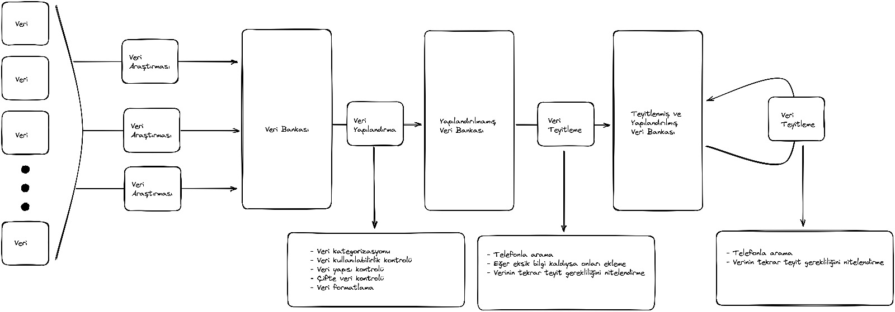

# Notlar: 11 Feb 2023

## Website

### Yapılması Gerekenler

- maps.afetbilgi.com o anki dile göre açılacak.
- donwload as pdf e şehirler listesi eklenecek.
- other donations -> item donations gibi bir şey olabilir, other garip duruyo
- Mony donations altında sayfaların isimleri Türkçe yazıyo. Çeviriyle uğraşmayıp direkt kurum ismini bırakalım.
- Top level city filter.
- Transportationın en sonucusunda "" tarihine kadar geçerlidir yazıyo. Bu tarz if flaglerini unutmayalım.

## Veri Girişi

### Yeni sistem tasarımı

Söze koyacak olursak.

1. Pek çok veri kaynağı var.
2. Veri kaynakları veri araştırması grupları tarafından toplanıp veri bankasına atılıyor(whatsapp)
3. Buradan veri bankasına gelen veriler kategorize ediliyor(gideceği sayfaya göre)
4. Kategorize edilen verilerin kullanılabilirliği nitelendiriliyor
5. Bu veride bizim kullanmamız için gerekli olan tüm alanların varlığı kontrol ediliyor
6. Bu veri bizim yapılandırılmış veri bankamızda yer alıyor mu kontrol ediliyor
7. Veri yapılandırılmış veri bankamıza doğru formatta ekleniyor(hot sheet/yeni bilgi)
8. Yapılandırılmış veriler tek tek aranıyor
9. Eğer bir önceki adımda eksik bir sütun kaldıysa buradaki aramalarla doldurulmaya çalışılıyor
10. Verinin tekrar teyitiyle ilgili bir not düşülüyor(kaç gün sonra tekrar teyit edilmesi gerektiğine dair bir tahmin olabilir)
11. Veri web sitesine ekleniyor
12. Veriler düzenli bir şekilde tekrar teyit ediliyor.
